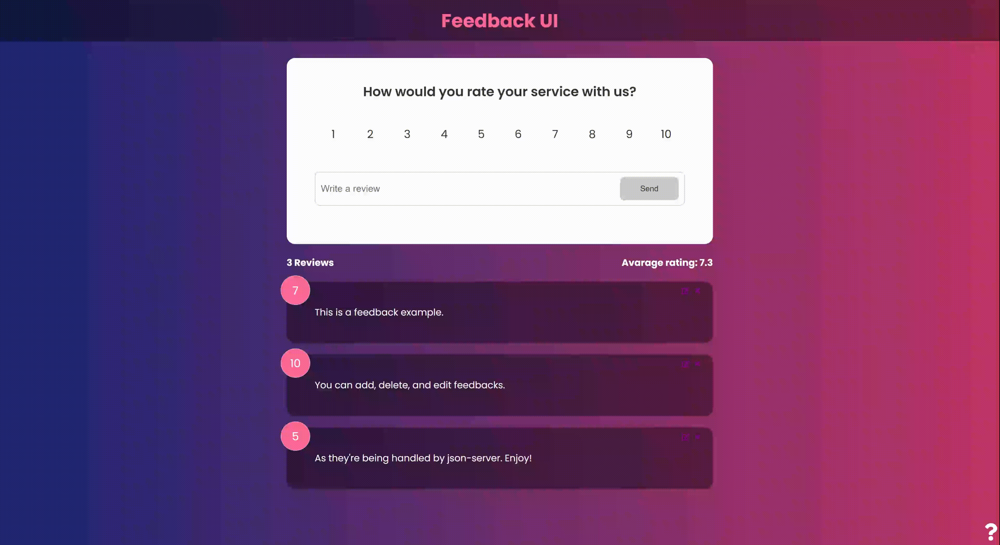

<a id="readme-top"></a>

<br />
<div align="center">
  <a href="https://github.com/ivanaogrizovic/feedback-app">
    
  </a>

<h3 align="center">Feedback UI</h3>

  <p align="center">
    <a href="https://github.com/ivanaogrizovic/feedback-app"><strong>Explore the docs »</strong></a>
    <br />
    <br />
    
    <br />
  </p>
</div>

<!-- TABLE OF CONTENTS -->
<details>
  <summary>Table of Contents</summary>
  <ol>
    <li>
      <a href="#about-the-project">About The Project</a>
      <ul>
        <li><a href="#built-with">Built With</a></li>
      </ul>
    </li>
    <li>
      <a href="#getting-started">Getting Started</a>
      <ul>
        <li><a href="#prerequisites">Prerequisites</a></li>
        <li><a href="#installation">Installation</a></li>
      </ul>
    </li>
    <li><a href="#contact">Contact</a></li>
    <li><a href="#acknowledgments">Acknowledgments</a></li>
  </ol>
</details>

<!-- ABOUT THE PROJECT -->

## About The Project

Feedback UI is a small full-stack application that allows you to add, edit, and remove feedback via CRUD operations.

<p align="right">(<a href="#readme-top">back to top</a>)</p>

### Built With

- [](#)
- [](#)
- [](#)
- [Framer Motion](https://motion.dev/)
- [Mock json-server](https://www.npmjs.com/package/json-server)

<p align="right">(<a href="#readme-top">back to top</a>)</p>

<!-- GETTING STARTED -->

## Getting Started

To get a local copy up and running follow these simple example steps.

### Prerequisites

You will need an IDE of your choice (like VSCode), and a terminal (VSCode terminal, bash, etc).
In your terminal of choice, run:

- npm
  ```sh
  npm install npm@latest -g
  ```

### Installation

1. Clone the repo
   ```sh
   git clone https://github.com/ivanaogrizovic/feedback-app.git
   ```
2. Install NPM packages
   ```sh
   npm install
   ```
3. To run both FE (port 5000) and BE (port 3000):
   ```sh
   npm run dev
   ```
4. Visit htpp://localhost:5000

If you have any other processes running on port 3000 or 5000, kill them.

<p align="right">(<a href="#readme-top">back to top</a>)</p>

<!-- CONTACT -->

## Contact

[LinkedIn](https://www.linkedin.com/in/ivana-ogrizovic/)

<p align="right">(<a href="#readme-top">back to top</a>)</p>

<!-- ACKNOWLEDGMENTS -->

## Acknowledgments

- This was made as part of a Udemy course for learning purposes

<p align="right">(<a href="#readme-top">back to top</a>)</p>
